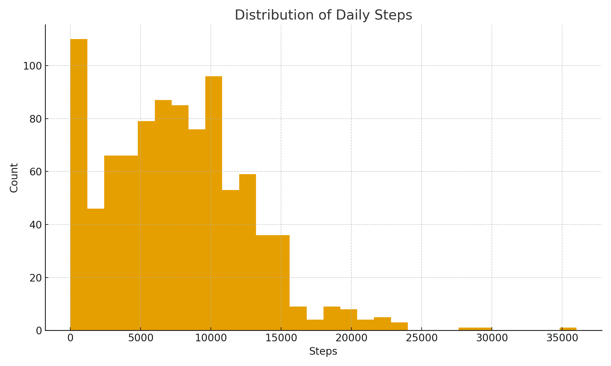
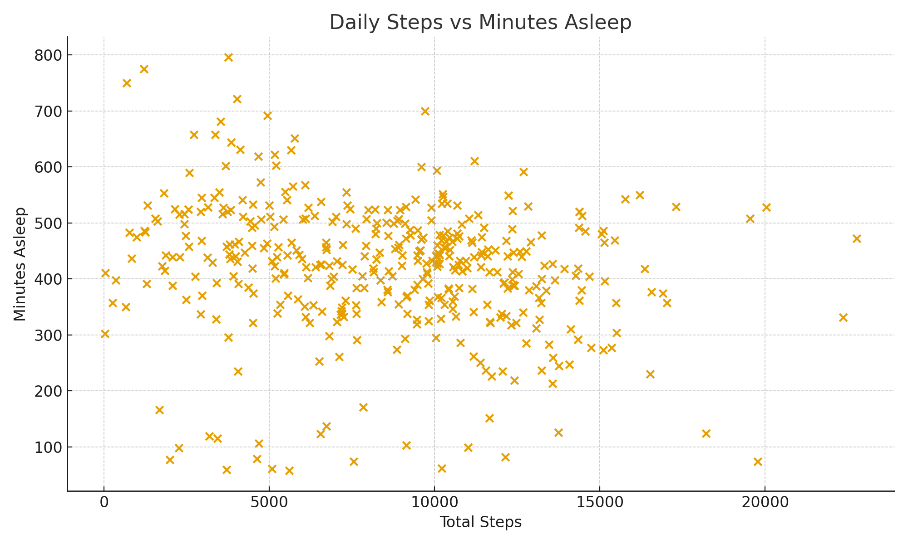

<link rel="stylesheet" href="styles.css">

  <h1>Bellabeat Case Study</h1>
  <h2>Analyzing Consumer Fitness Behavior Using Fitbit Data</h2>
  
A Python-based exploration of user activity, calories burned, and sleep behavior.

---

## 📊 Key Visualizations

  
  
Daily Steps Distribution

  
  
Calories vs Total Daily Steps

  
  
Daily Steps vs Minutes Asleep

---

## 📘 Download Reports

- **[Full Case Study Report (PDF)](../Bellabeat_Final_Report.pdf)**
- **[Executive Summary (PDF)](../bellabeat_executive_summary.pdf)**

---

## 🧠 Project Overview

This case study explores publicly available Fitbit data to understand:

- user activity levels  
- calorie expenditure patterns  
- sleep duration behavior  

The goal is to identify insights that may support **Bellabeat’s wellness product strategy**.

The analysis was conducted using **Python**, including:

- data cleaning & preparation  
- exploratory analysis  
- visualization  
- report generation  

---

## 📓 Jupyter Notebook

Access the full workflow:  
👉 **[bellabeat_analysis.ipynb](../bellabeat_analysis.ipynb)**

---

## 🧩 Methodology Summary

- Cleaned and merged daily activity, steps, and sleep datasets  
- Converted date fields for consistency  
- Explored distributions and correlations  
- Built visualizations using Matplotlib  

---

## 🔎 Key Insights

- Most users average **6k–9k steps** daily  
- Steps and calories burned show a **strong positive correlation**  
- Steps and sleep duration show **no significant relationship**

---

## 📌 Contact

This project is part of a personal data analytics portfolio.  
Feel free to explore the analysis or reach out with questions.
